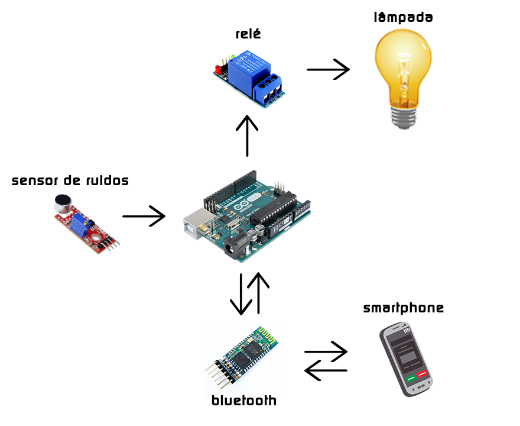

[Smart Light](https://github.com/ggarduino1/smartlight) (Lâmpada Inteligente)
=======
Sistema de acionamento de uma Lâmpada de forma inteligente.

Neste projeto é apresentado uma forma de fácil entendimento e fácil custo de automatizar uma parte da sua residência, e tem como propósito facilitar o acesso a iluminação no local desejado. O sistema torna uma lâmpada sensível a palma ou qualquer outro alto ruído, e a torna controlável através de um aplicativo de sistema Android por meio da conexão Bluetooth de um Smartphone. 

## Componentes utilizados:
* Arduino UNO ou NANO
* Lâmpada LED 7W
* Módulo Relé de 1 canal
* Sensor de som Ky-038
* Módulo Bluetooth
* App 'Botão via Bluetooth' (disponível na PlayStore)
* Jumpers para conexões com o Arduino
* Cabo para conexões da Lâmpada com o Relé e a tomada

## Tecnologias:
### Placa
* Arduino
### Linguagem
* C++ (Arduino IDE)
* [Sketch](https://github.com/ggarduino1/smart_light/sketch/smartlamp.ino)

## Funcionamento:
Logo que é alimentado, o sistema de palmas imediatamente entra em funcionamento, qualquer palma ou ruído muito alto será o suficiente para que o sensor de som mande a informação para que o Arduino acione o Relé conectado à lâmpada, acendendo-a.

Para acessar o sistema bluetooth, o usuário deve baixar o app do Botão disponível na PlayStore e conectá-lo ao Arduino via bluetooth. Após conectado, basta apertar o botão no Smartphone para que o Relé conectado à lâmpada seja acionado, acendendo-a.

## Circuito

.
.
.

## Desenvolvido por: [GG Arduino](https://www.instagram.com/gg_arduino/)
